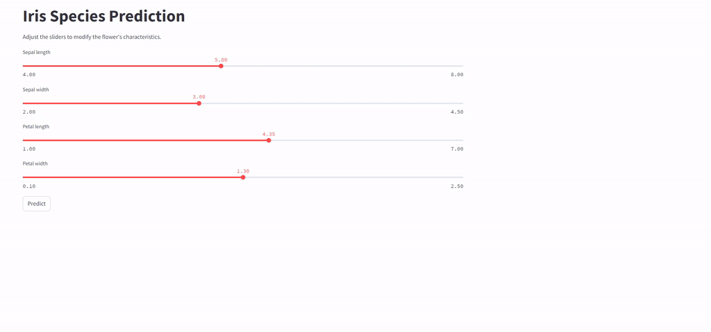

# ⚡⚡⚡ Petal predictor™ ⚡⚡⚡

Do you only sell irises? This service is made for you. Measure the characteristics of your Iridaceae specimens, and our artificial intelligence will predict their species with accuracy that would make a botanist blush!

Iris setosa, versicolor, or virginica? More reliable than a retired gardener, Petal Predictor will give you the answer in an instant

Petal Predictor, the power of AI serving plants.


## Table of Contents

- [Prerequisites](#Prerequisites)
- [Installation](#Installation)
- [Launch program](#Launch-program)
- [Accessing services](#Accessing-services)
- [Stopping services](#Stopping-services)
- [Contribution](#contribution)

## Prerequisites

Before you start, make sure you have [Docker desktop](https://docs.docker.com/get-started/get-docker/) and [Docker Compose](https://docs.docker.com/compose/install/) installed on your machine. Docker desktop should be running, docker compose should be operationnal and executable on your machine.

## Installation

To clone this project, run the following command in your terminal :

```bash
git clone https://github.com/berangerthomas/petal-predictor
```

## Launch program

Launch Docker Desktop, then in your command line interface, navigate to the project's root directory:
```bash
cd petal-predictor
```

start the services by executing the following command :
```bash
docker-compose up
```

This command will build the necessary Docker images and start the services defined in the `docker-compose.yml` file.


Alternatively, if you have already launched the program at least once and would like to benefit from improvements, here's the procedure:

1. Navigate to your local directory containing petal-predictor, and type:
```bash
git pull
```

2. Then you'll need to rebuild the Docker images. Simply type:
```bash
docker-compose up --build
```

This will rebuild the images and immediately launch the program..


## Accessing services

- **Client (Streamlit)** : launch `http://localhost:8501`
- **API server (FastAPI)** : launch `http://localhost:8000`

## Stopping services

To stop the services, press `Ctrl+C` in the terminal where the services are running, then execute :

```bash
docker-compose down
```

This will stop and delete the containers created by `docker-compose up`.

## Contribution

Contributions are welcome! To contribute:
- Fork the project.
- Create your feature branch (git checkout -b feature/FeatureName)..
- Commit your changes (git commit -m 'Description of changes').
- Push to the branch (git push origin feature/FeatureName).
- Open a Pull Request.
